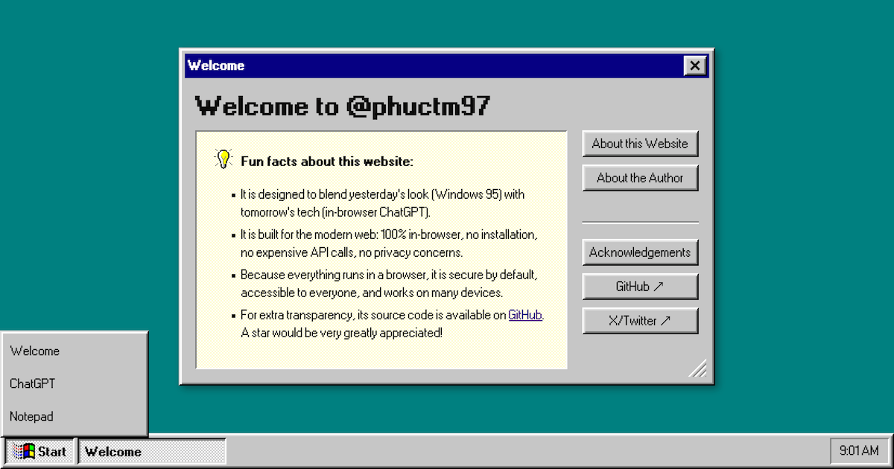

<h3 align="center">Windows 95 UI 💞 ChatGPT-like AI</h3>

    A fun portfolio that blends yesterday’s look (Windows 95) with tomorrow’s tech (in-browser ChatGPT).

## Features

- **Windows 95 UI**: A nostalgic look and feel of the classic Windows 95 operating system

- **ChatGPT-like AI**: An in-browser ChatGPT-like AI, powered by [WebLLM]

- **Notepad**: A simple Notepad-like text editor

- Everything runs in a browser: it is 100% local, makes zero API calls, works offline, and requires no installation.

- It is responsive and mobile-friendly.

- It is statically generated to be fast and SEO-friendly.

## Tech stack

- [Next.js] & [React]: Web Framework & Library

- [TypeScript]: Programming Language

- [Styled Components]: CSS in JS

- [WebLLM]: In-Browser LLM

- [React95]: UI Components

- [React95 Icons]: UI Icons

- [Jotai]: State Management

<!-- Links -->

[Next.js]: https://nextjs.org
[React]: https://react.dev
[TypeScript]: https://www.typescriptlang.org
[Styled Components]: https://styled-components.com
[WebLLM]: https://webllm.mlc.ai
[React95]: https://react95.io
[React95 Icons]: https://react95.github.io/React95
[Jotai]: https://jotai.org
